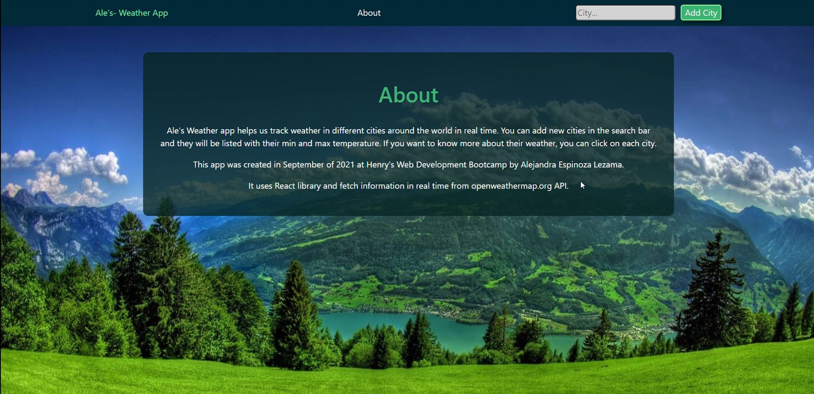
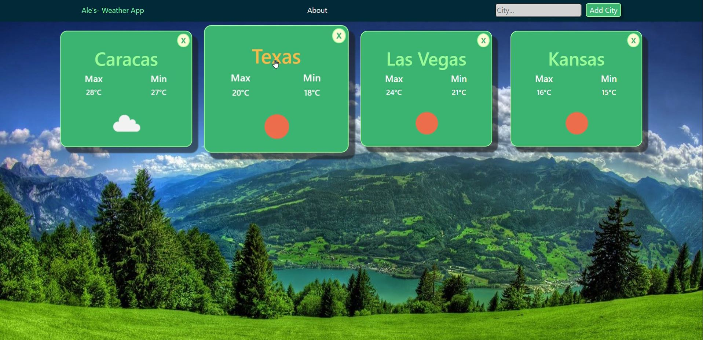
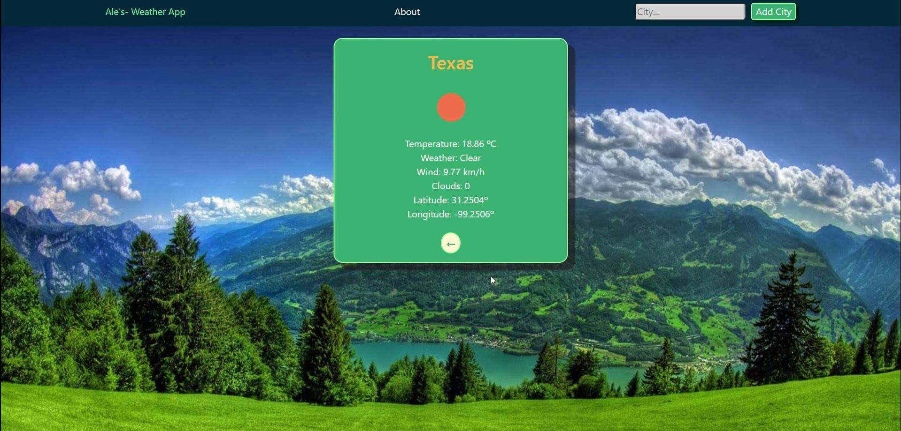

# Weather App
https://openweathermap.org/api

you can find the weather status from diferent countries and cities, and see info about max or min temp.

#SoyHenry Bootcamp

## Try it out
After clone this respository, open the project console.
 
Inside, run the command line: npm install.
 
Then: npm start.

## Deploy
Or you can try it at: 
<a href="https://aleespinozama.github.io/weather-app/">Weather App </a>

## Project Screens
About:

Home:

Detail:

